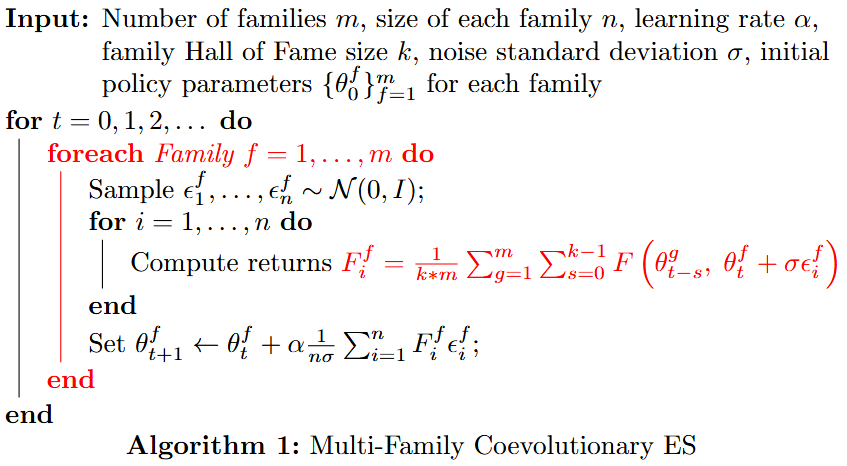
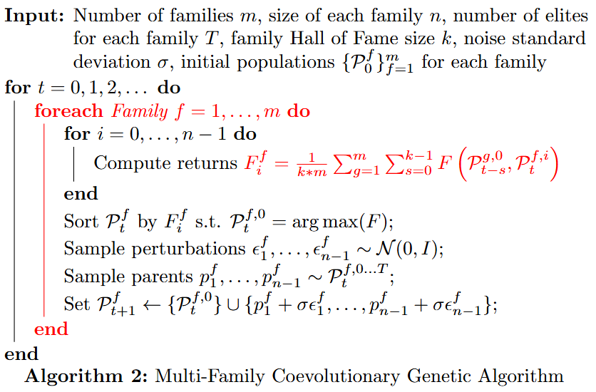

# A Multi-Family Co-Evolutionary Approach for Multi-Agent Reinforcement Learning

Project developed for the course of "Reiforcement Learning" during the MSc in Artificial Intelligence and Robotics at Sapienza University of Rome, A.Y. 2024-2025.

## Evolutive Multi-Family Strategies (EMS)


## Genetic Multi-Family Algorithm (GMA)


## How to run
- Clone this repository 
    - ```git clone https://github.com/EmaMule/RLProject.git```
- Install the requirements
    - ```pip install -r requirements.txt```
- For executing the first algorithm (EMS) use the following command:
    - ```!python ./main.py EMS```
- For executing the second algorithm (GMA) use the following command:
    - ```!python ./main.py GMA```

Alternatively you can use the provided notebook.ipynb by loading it on google colab or kaggle environments.

# Acknowledgement

The games considered are multi-agent environments from PettingZoo's classic environments: https://pettingzoo.farama.org/environments/classic/

The inspiration for the work comes from Daan Klijn and A.E. Eiben. 2021. “A coevolutionary approach to deep multi-agent reinforcement learning”. (https://arxiv.org/pdf/2104.05610)

